<div align="center">
  

  <h1>Axiom OS</h1>
  <p>The zero-gravity development environment for building and deploying distributed capabilities via WebAssembly (Wasm) Kernels and Tomains.</p>
</div>

---

## ⚡ The Ultimate AI-Native Cloud Paradigm

Axiom OS is a completely new paradigm for building, deploying, and managing distributed applications that radically minimizes the code you write and the infrastructure you pay for. 

By stripping application code down to **pure business logic (Wasm Kernels)** and offloading all common layer code (DB connections, caching, authentication, logging) to our native Rust-based host (`axiom-shell`), Axiom OS delivers compounding benefits:

*   **💸 Slash Cloud Bills:** Wasm Kernels share memory and boot in under a millisecond. You can run hundreds of microservices on a single $5/mo VPS that would traditionally require a massive Kubernetes cluster.
*   **🏎️ Insane Performance:** Skip the Node.js or Python interpreter overhead. Execute at near-native speeds in a highly concurrent Rust server.
*   **🐳 No More Memory-Hungry Docker:** Emulating full OS virtualization per microservice is incredibly wasteful. `axiom-shell` runs dozens of isolated Wasm Kernels in a single lightweight process, eradicating Docker container bloat entirely.
*   **🧠 Optimized for AI Agents:** AI coding agents (like Cursor, Copilot, or Claude) write code exponentially faster in Axiom because there is *zero boilerplate*. They don't waste tokens writing environment variables, database drivers, or connection pools. They just write the small, focused business logic. Less tokens = faster generation, fewer bugs, and cheaper prompts. 
*   **🛡️ Developer Velocity:** Axiom eliminates `.env` files, complex environment checks, and traditional container orchestration. Say goodbye to "it works on my machine" forever.

Through the **Central Control Plane (CCP)**, you visually map physical cloud resources (Databases, Caches, Secrets) to your Kernels dynamically based on the environment context (Dev, QA, Staging, Prod).

---

## 🚀 Installation & Getting Started

Axiom OS provides a unified CLI tool (`ax`) that handles the download and orchestration of all internal services (the Shell host, the CCP backend, and the dashboard frontend).

### 1. Install the CLI (`ax`)

You can install the Axiom CLI easily via `curl`:
```bash
curl -sL https://axiom.os/install.sh | sh
```
*(Alternatively, macOS users can run `brew tap shafeeq/axiom && brew install axiom`)*

### 2. Initialize a Project (Zero-to-Dashboard Workflow)

To create a new Wasm Kernel project and instantly boot up the local Axiom Shell and CCP Dashboard, just run:

```bash
mkdir my-app && cd my-app
ax init
```
This single command will:
1. Scaffold a new Rust-to-Wasm project framework.
2. Generate local `localhost` SSL certificates.
3. Start the **Axiom Shell** in the background to host your WebAssembly.
4. Start the **Axiom CCP Backend & Frontend** on port 9000.
5. Automatically open the CCP Dashboard in your browser!

### 3. Core CLI Commands

Axiom OS heavily relies on its unified CLI to manage environments, features, and deployments.

*   `ax init <name>`: Scaffolds a new Wasm Kernel, starts the local Shell and CCP, and registers the Tomain.
*   `ax deploy <env>`: Compiles the local Wasm Kernel and loads it directly into the running Axiom Shell for the specified environment (`dev`, `staging`, `prod`).
*   `ax checkout <address>`: Clones an existing Tomain and its Capability Manifest from the CCP to your local machine (e.g., `ax checkout alpha-squad.default.my-app`).
*   `ax feature start <name>`: Checks out a new isolated feature branch in the local git vault and registers the feature with the CCP.
*   `ax bind --name <alias> --url <url>`: Binds a physical resource (e.g., a Postgres database URL) to a logical alias for the current environment. Wasm Kernels only ever ask for the alias.
*   `ax push`: Compiles the current Wasm Kernel, commits local changes, and uploads the `.wasm` binary to the CCP's binary vault for staging/production promotion.
*   `ax promote --from <env> --to <env>`: Promotes a verified Tomain (or feature) from a lower environment (like `dev` or `qa`) to a higher environment (`staging` or `prod`). The CCP automatically swaps the resource bindings during the promotion.
*   `ax retire -m <ms> -e <env>`: Safely removes a microservice from a specific environment.

---

## 🏛️ The Four Pillars of Axiom

1. **`axiom-shell` (The "Body"):** Native Host for Wasm Kernels. Built in Rust and Wasmtime for blistering performance and multi-tenant security.
2. **`axiom-ccp` (The "Brain"):** The Central Control Plane. Manages environment-to-resource mapping. Provides the beautiful React UI shown below.
3. **`axiom-ide` (The "Lens"):** Environment-agnostic coding interface. Focuses on Contextual Session-Locking.
4. **`axiom-sdk` (The "Language"):** High-level 'Intent' APIs using WIT. Focuses on defining standard interfaces without knowing *how* they are fulfilled.

---

## 👁️ Visual Walkthrough: The CCP Dashboard

The Central Control Plane (CCP) is where you orchestrate your application. 

### 1. Environment Dashboards
You have complete visibility into what services are running in which environment. The CLI allows you to promote services effortlessly.

#### Development (DEV)
The playground for building Kernels. Connects to local or mocked databases.
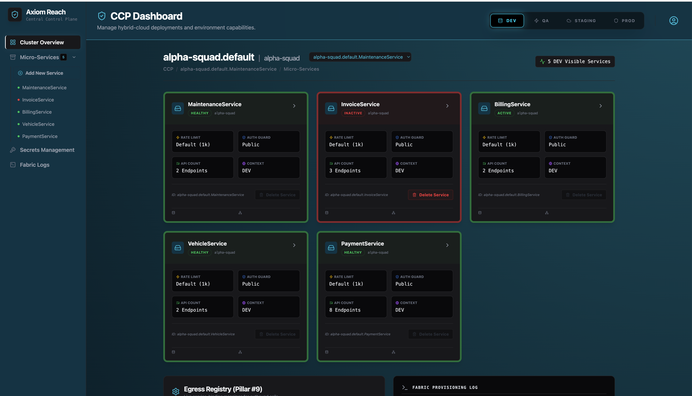

#### Quality Assurance (QA)
Integration testing. The CCP seamlessly swaps out the underlying resources used by your Wasm Kernels without changing any code.
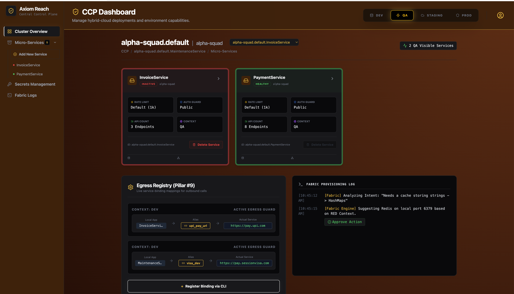

#### Staging
Pre-production validation with replica data and endpoints.
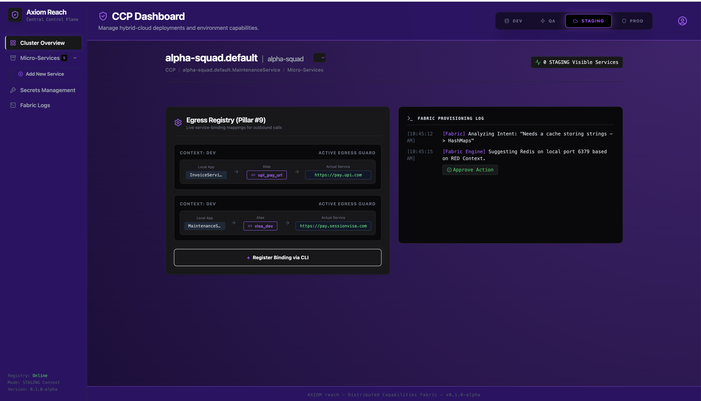

#### Production (PROD)
The live fire zone. The Axiom Shell routes requests strictly through the production bindings assigned here.
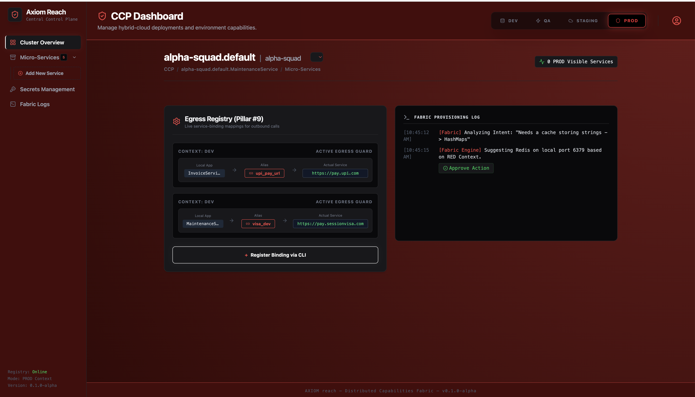

---

### 2. The Service Hub

Manage individual Tomains (Microservices) from a detailed, dynamic view. Here you can track deployment history and health metrics.

#### Dev Service View
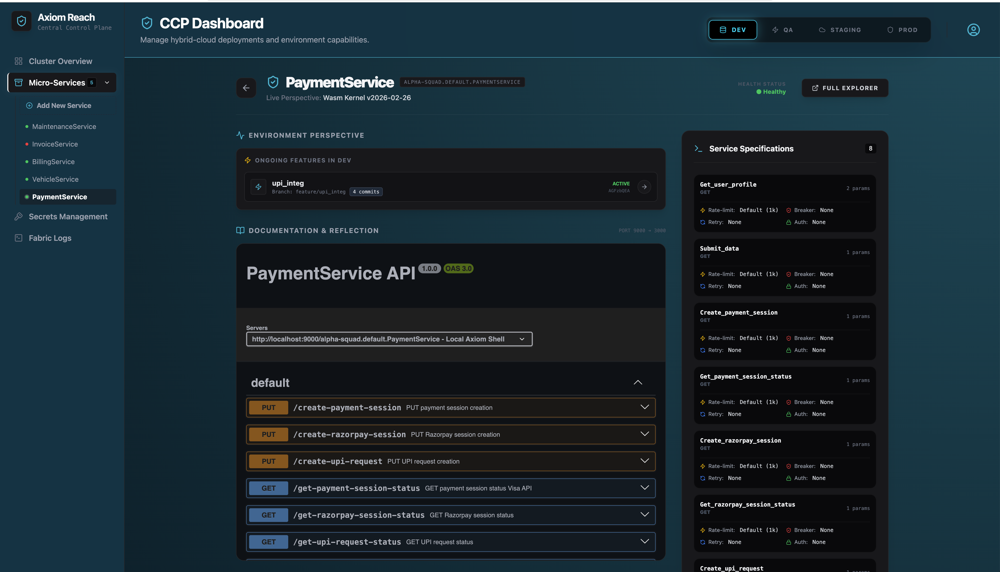
#### QA Service View
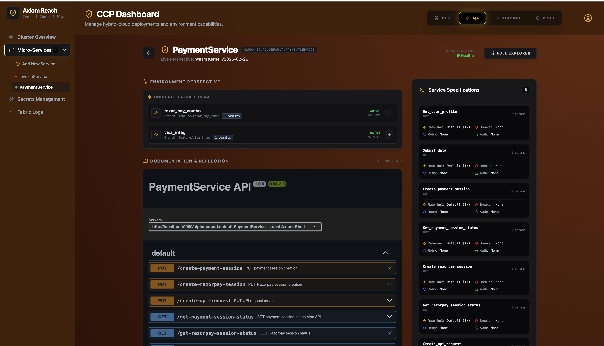
#### Staging Service View
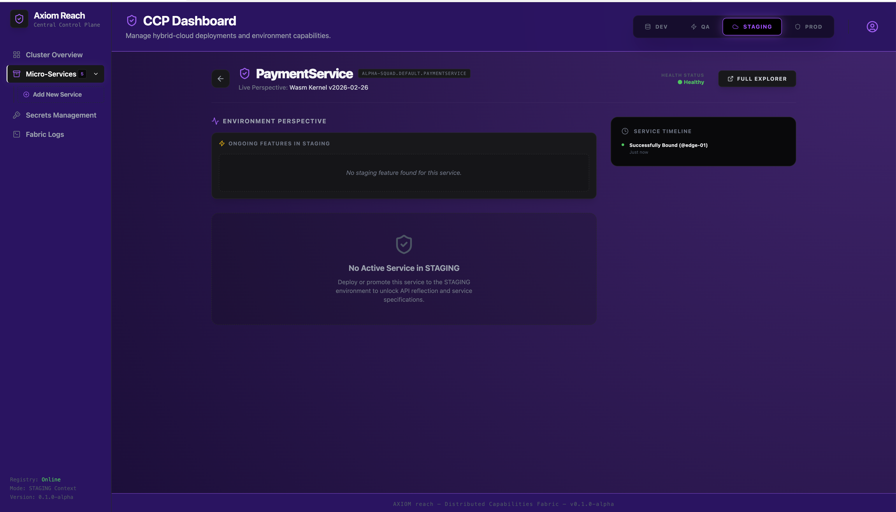
#### Prod Service View
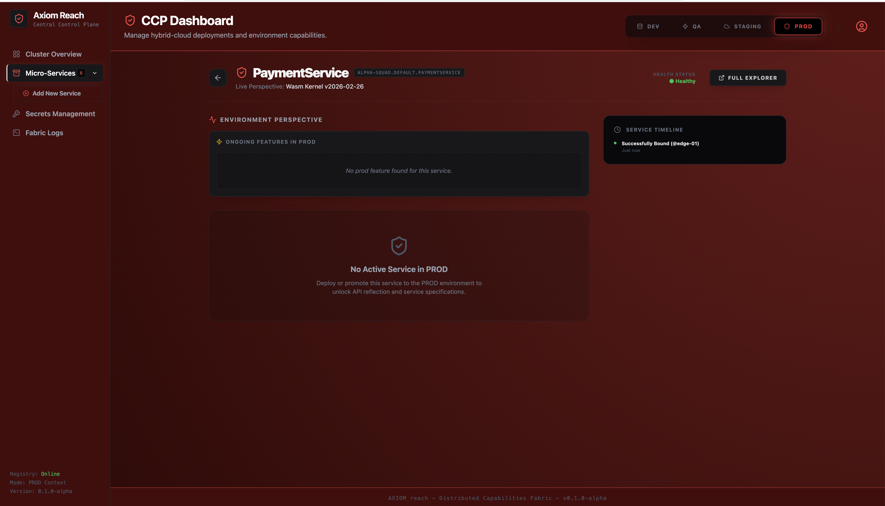

---

### 3. Creating & Managing Resources

The core magic of Axiom OS lies in **Resource Bindings**. Your Wasm Kernel asks for a "Postgres Database". The CCP determines *which* database to provide based on the environment.

#### Creating a New Service
Provision new capabilities and Tomains to the cluster globally.
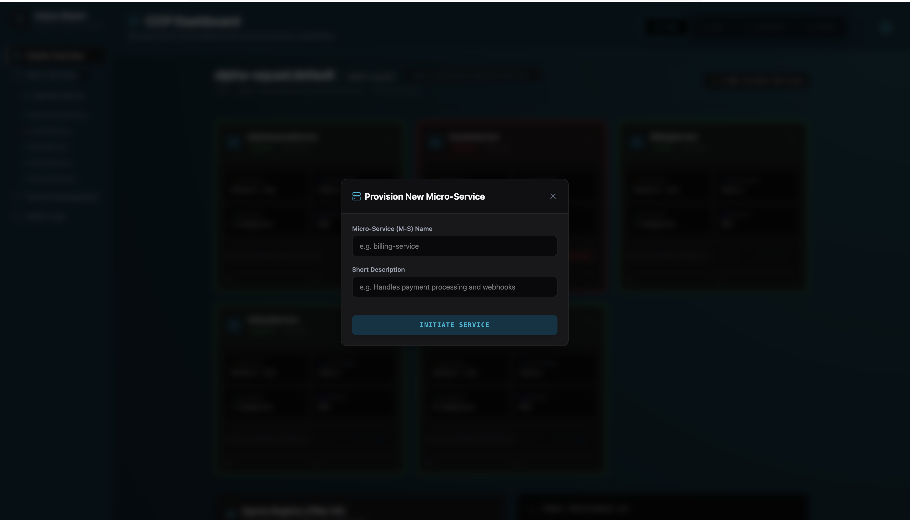

#### Binding Resources Safely
Securely tie connection strings, secrets, and URLs to a service alias. The Wasm Kernel never sees the actual connection string, only the sandbox bridge provided by the Axiom SDK!
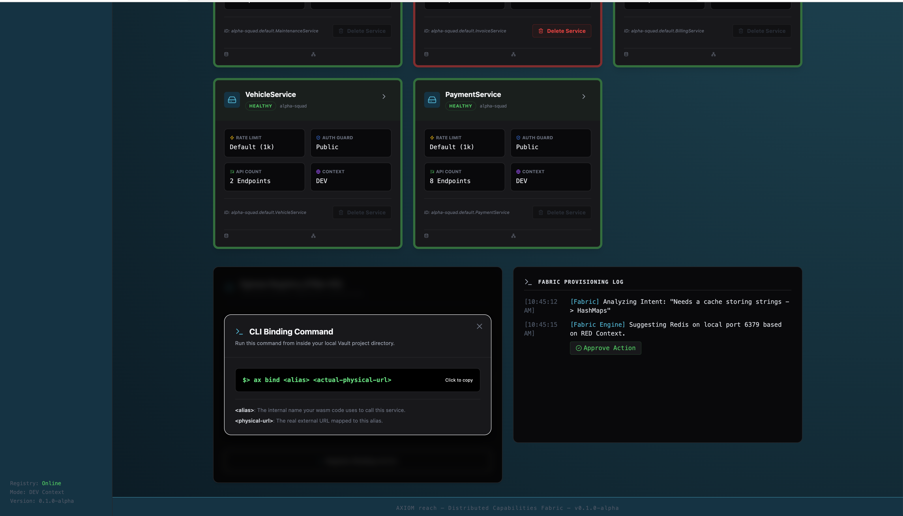

#### Retiring / Deleting Services
Safely remove microservices from specific environments when they are no longer needed.
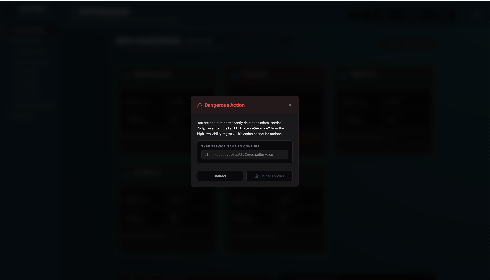

---

## 🛠️ The Zero-Gravity Lifecycle 

Axiom OS eliminates the need for `.env` files and `if (process.env === 'production')` statements. Your Wasm Kernel is entirely ignorant of its environment.

The CCP orchestrates a 4-tier lifecycle:

1. **DEV Phase:** The developer writes abstract "Intent" code (e.g., `db.query("...")`). The local IDE maps this intent to local mock databases or transient SQLite instances.
2. **QA Phase:** The `ax promote` command pushes the compiled Wasm to the QA environment. The CCP dynamically injects bindings for integration-testing resources. The code remains completely unchanged.
3. **STAGING Phase:** Ready for pre-production validation. The CCP maps `db.query` to a staging database clone containing realistic data to catch late-stage bugs.
4. **PROD Phase:** The exact same Wasm binary is promoted to Production. The host environment (`axiom-shell`) now connects the Intent API to secure, production-grade databases with raw throughput. No code changes. No `.env` leaks. Absolute parity.

---
*Built with ❤️ for a post-Docker world by [Shafeequl Islam](https://shafeeq.dev).*
